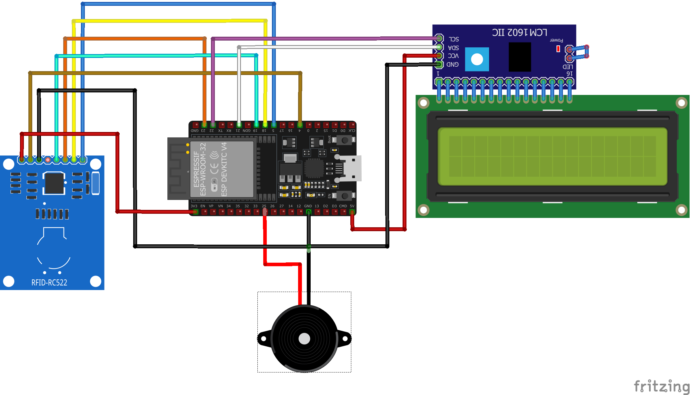

# 📚 ESP32 Attendance System with Google Sheets

A student attendance management system built with ESP32 and RFID (Module MFRC522), with data uploaded directly to Google Sheets for easy access and management.

## 📝 Project Overview
This project develops an automated attendance system using the ESP32 microcontroller and RFID technology (MFRC522 module). It reads RFID tags, records attendance (UID, name, timestamp, and status), and uploads the data to Google Sheets via HTTP requests. The system also features an LCD display (I2C) to show attendance details and a buzzer for audio feedback.

### ✨ Features
- **RFID-based Attendance**: Scans RFID tags to identify students and record attendance.
- **Google Sheets Integration**: Uploads attendance data (name, timestamp, status) to Google Sheets for real-time tracking.
- **LCD Display**: Shows student name and attendance status (e.g., "On Time" or "Late").
- **Buzzer Feedback**: Plays a sound ("beep") when a card is scanned.
- **Local Storage**: Uses SPIFFS to store UID-to-name mappings for faster lookup.
- **Time-based Status**: Automatically marks attendance as "On Time" or "Late" based on a predefined schedule (e.g., 8:00 AM).

## 🛠️ Technologies Used
- **Hardware**:
  - 🧠 ESP32 microcontroller
  - 📶 MFRC522 RFID module
  - 🖥️ LCD I2C display
  - 🔔 Buzzer
- **Software**:
  - Arduino IDE
  - Libraries: `WiFi.h`, `HTTPClient.h`, `MFRC522v2.h`, `LiquidCrystal_I2C.h`
  - Google Apps Script (for Google Sheets integration)
  - SPIFFS (for local storage)
- **Programming Language**: C++ (Arduino)

## 🔌 Hardware Setup
1. **Connect the MFRC522 RFID module to the ESP32**:
   - SDA -> GPIO 5  
   - SCK -> GPIO 18  
   - MOSI -> GPIO 23  
   - MISO -> GPIO 19  
   - RST -> GPIO 4  
   - GND -> GND  
   - 3.3V -> 3.3V  

2. **Connect the LCD I2C**:
   - SDA -> GPIO 21  
   - SCL -> GPIO 22  
   - VCC -> 5V  
   - GND -> GND  

3. **Connect the buzzer**:
   - Positive -> GPIO 25  
   - Negative -> GND  

## 💻 Software Setup
1. **Install Arduino IDE** and required libraries:
   - `WiFi.h`
   - `HTTPClient.h`
   - `MFRC522v2.h`
   - `LiquidCrystal_I2C.h`
2. **Configure Google Sheets**:
   - Create a Google Sheet.
   - Deploy a Google Apps Script to handle HTTP requests (refer to `docs/google_apps_script.js` if available).
   - Copy the script URL.
3. **Configure WiFi and Server**:
     #define WIFI_SSID "Your_WiFi_SSID"
     #define WIFI_PASSWORD "Your_WiFi_Password"
     #define GOOGLE_SHEETS_URL "https://script.google.com/macros/s/Your_Script_ID/exec"
4. **Upload Code**:
   - Open main.ino in Arduino IDE.
   - Upload the code to the ESP32.

## ▶️ Usage
1. Power on the ESP32 system.
2. Scan an RFID card:
   - The LCD displays the student's name and status ("On Time" or "Late").
   - The buzzer beeps to confirm the scan.
3. Check the Google Sheet for updated attendance records (name, timestamp, status).

## 📌 ESP32 Pinout
(assets/images/ESP32-38pin-Develeopmen-Board-1.png)

## 📋 Program Flow
The program operates in a structured loop to manage attendance. Below is the flow:

  **Initialization (Setup):**
   - Initialize Serial, SPI, RFID (MFRC522), LCD, and buzzer.
   - Connect to WiFi using predefined SSID and password.
   - Display "WiFi Connected" and IP address on LCD if successful; retry with feedback if unsuccessful.
  **Main Loop:**
   - Check RFID Card: If no card is detected, display "PLEASE SCAN CARD..." on LCD.
   - Card Detection: When a card is scanned, read the UID, display "Card Detected", and trigger a beep.
   - WiFi Check: If connected, send UID to Google Sheets via HTTP GET.
      - Success (HTTP 200): Retrieve and display the student's name.
      - Redirect (HTTP 302): Follow the redirect and display the name.
      - Error: Display "HTTP Error: [code]" or "Server Failed".
   - WiFi Lost: Display "WiFi Lost" and attempt reconnection.
   - Cleanup: Halt RFID communication and reset crypto state.

## 💻 Code Explanation
**Key Functions:**
   - **WiFi.status() == WL_CONNECTED**: Checks if WiFi is connected, enabling HTTP requests to Google Sheets.
   - **http.GET()**: Sends an HTTP GET request to retrieve attendance data from the server.
   - **http.getString()**: Fetches the response (e.g., student name) from the server.
   - **mfrc522.PICC_IsNewCardPresent()**: Detects the presence of a new RFID card for scanning.
   - **mfrc522.PICC_ReadCardSerial()**: Reads the UID from the detected RFID card.
   - **mfrc522.PICC_HaltA()**: Stops communication with the RFID card after reading.
   - **mfrc522.PCD_StopCrypto1()**: Resets the encryption state of the RFID reader.

## 📊 Result Reports
The system records attendance data and uploads it to Google Sheets, providing real-time updates. Based on the provided data:
**Student list**:
(assets/images/student_uid_list.png)
**Attendance Results**:
   - Data is logged in another tab with timestamps and status.
   - Example (as of test data):
(assets/images/result1.png)
**Demo Output**:
   - When a card is scanned (e.g., UID "2CF5FA03"), the LCD displays:
   - Initially: "Card Detected UID: 2CF5FA03"
   - After processing: "Welcome: Nguyen Van B"
(assets/images/result.png)
   - Left: Card detection with UID.
   - Right: Welcome message with name.

🔮 Future Improvements
- 🕰️ Add a real-time clock (RTC) module for better time accuracy.
- 🌐 Implement a web dashboard for attendance monitoring.
- 🔐 Add user authentication for secure access to Google Sheets.

👤 Author
Name: Hoang An Nguyen
GitHub: NguyenAn080105
Email: nguyenan080105@gmail.com
